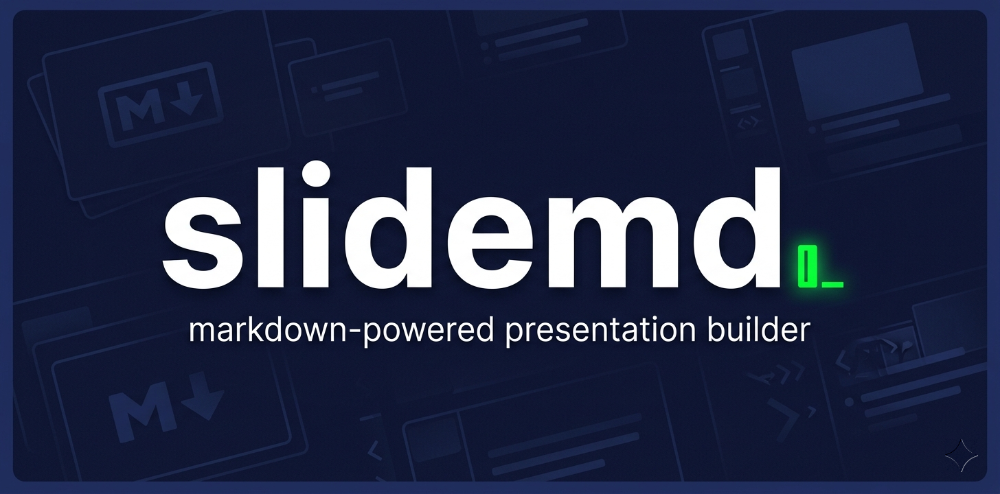

# slidemd

A set of markdown prompt files that turn Claude into a premium presentation builder. Drop them into a Claude skill and get a full design interview → outline → image generation → `.pptx` output pipeline.

## Files

```
SKILL.md                   # Main workflow — the 8-phase build process
references/
  design-system.md         # Color palettes, layouts, typography, anti-slop rules
  pptxgenjs-api.md         # Code patterns for every slide element
```

## What it does

1. **Interviews you** — topic, audience, tone, colors, structure, image style, data/charts, speaker notes
2. **Shows a design brief** — get approval before anything is built
3. **Shows a slide outline** — approve the structure before code runs
4. **Generates images** via Gemini CLI (falls back to shapes/placeholders if unavailable)
5. **Builds the `.pptx`** using [PptxGenJS](https://gitbjarke.github.io/PptxGenJS/)
6. **Exports speaker notes** — embedded in the deck + a separate `speaker-notes.md`
7. **QA pass** — checks for overflow, missing content, placeholder text
8. **Delivers** the files and flags anything needing your review

## Setup

```bash
npm install -g pptxgenjs
```

Gemini CLI optional — needed for AI image generation per slide.

## Usage

Install as a Claude skill or paste `SKILL.md` into your system prompt. Then just ask:

> *"Make me a presentation on climate change for my science class"*
> *"Build a pitch deck for my startup"*

Claude will run the full interview before touching any code.

## Anti-hallucination

The skill only uses facts you provide or things Claude knows with certainty. Anything uncertain is flagged `[USER TO VERIFY]` — it never invents stats, quotes, or data.

## Stack

- [PptxGenJS](https://github.com/gitbrajesh/PptxGenJS) — slide generation
- [Gemini CLI](https://github.com/google-gemini/gemini-cli) — image generation
- LibreOffice + Poppler — PDF conversion for QA previews
